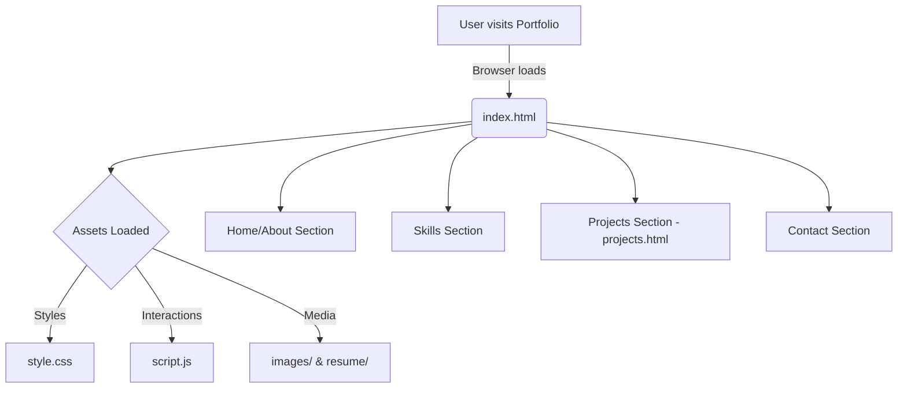

<div align="center">

# 👨‍💻 Santhosh CV - Personal Developer Portfolio

**A modern, responsive, and lightweight developer portfolio built from scratch.**

[Live Demo](#) | [Report Bug](https://github.com/Santhoshcv07/santhosh-portfolio/issues) | [Request Feature](https://github.com/Santhoshcv07/santhosh-portfolio/issues)


</div>

---

## 🎯 What it does

This repository contains the source code for my personal developer portfolio website. It serves as a central hub to showcase my professional background, technical skills, and featured projects. Built from the ground up using pure HTML, CSS, and JavaScript, the portfolio is optimized for speed and performance without relying on heavy frameworks. It's designed to provide visitors—whether recruiters, developers, or clients—with a comprehensive and interactive look at my work and capabilities.

## ✨ Key Features

- **📱 Fully Responsive Design:** Flawless rendering across all devices, from mobile phones to large desktop monitors.
- **🎨 Custom UI/UX:** A clean, modern interface designed from scratch, utilizing smooth animations and an intuitive layout.
- **💼 Dynamic Project Showcase:** A dedicated section displaying featured projects with detailed descriptions and links.
- **📄 Direct Resume Integration:** Easy access for users to view and download my latest professional resume.
- **⚡ Lightweight & Fast:** Built with vanilla web technologies ensuring rapid page loads and high performance.

## 🏗️ Architecture & Workflow

The portfolio relies on a straightforward static architecture, utilizing semantic HTML for structure, custom CSS for styling, and Vanilla JS for interactive elements.



## 📁 Folder Structure

Here is a detailed look at the repository's structure:

```text
📦 santhosh-portfolio
 ┣ 📂 images/          # Image assets (profile pictures, project screenshots, icons)
 ┣ 📂 resume/          # PDF versions of the professional resume
 ┣ 📜 index.html       # The main landing page (Hero, About, Skills, Contact)
 ┣ 📜 projects.html    # Dedicated page showcasing detailed project information
 ┣ 📜 style.css        # Global stylesheet and responsive design rules
 ┣ 📜 script.js        # Interactive logic (DOM manipulation, animations, event listeners)
 ┗ 📜 README.md        # Project documentation
```

## 🛠️ Setup & Local Development

Because this project is built using vanilla web technologies, getting it running locally is incredibly simple. There are no node modules to install or complex build steps.

### Prerequisites

All you need is a modern web browser and optionally a code editor (like VS Code) with a Live Server extension.

### Steps to Run

1. **Clone the repository:**
   ```bash
   git clone https://github.com/Santhoshcv07/santhosh-portfolio.git
   ```
2. **Navigate into the directory:**
   ```bash
   cd santhosh-portfolio
   ```
3. **Launch the site:**
   - **Method 1:** Simply double-click the `index.html` file to open it in your default browser.
   - **Method 2 (Recommended):** If you are using VS Code, right-click `index.html` and select **"Open with Live Server"**. This will automatically reload the page when you make changes.

## 🚀 Deployment

The portfolio is designed to be easily hosted on any static site hosting service. 

**Deploying to Vercel (Recommended):**
1. Push your code to a GitHub repository.
2. Log in to [Vercel](https://vercel.com/) and create a "New Project".
3. Import your GitHub repository.
4. Leave the build settings as default (Framework Preset: Other) since it's a static site.
5. Click **Deploy**.

*You can also deploy it easily via GitHub Pages, Netlify, or standard web hosting.*

## 🔮 Future Scope & Use Cases

### Potential Use Cases
- **Professional Branding:** A centralized platform for recruiters and hiring managers to evaluate my skills.
- **Project Documentation:** A visual catalog of personal and freelance projects.
- **Freelance Pitching:** A professional storefront to attract and secure freelance clients.

### Roadmap & Future Features
- [ ] Implement a Dark/Light mode toggle.
- [ ] Add a functional contact form utilizing a backend service (e.g., Formspree or EmailJS).
- [ ] Create a dynamic blog section using a headless CMS.
- [ ] Enhance accessibility (a11y) to meet WCAG 2.1 standards.
- [ ] Integrate a 3D model or advanced interactive canvas background.

## 🤝 Contribution

While this is a personal portfolio, constructive feedback, bug reports, or feature suggestions are always welcome!

1. Fork the Project
2. Create your Feature Branch (`git checkout -b feature/AmazingFeature`)
3. Commit your Changes (`git commit -m 'Add some AmazingFeature'`)
4. Push to the Branch (`git push origin feature/AmazingFeature`)
5. Open a Pull Request

---
<div align="center">
Made with ❤️ by Santhosh CV
</div>
